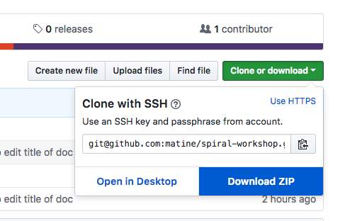
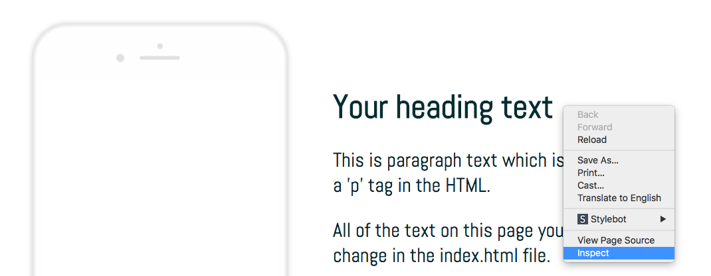
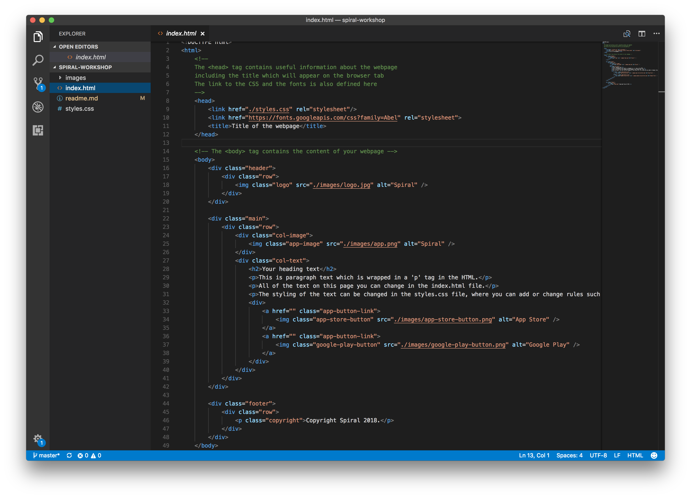
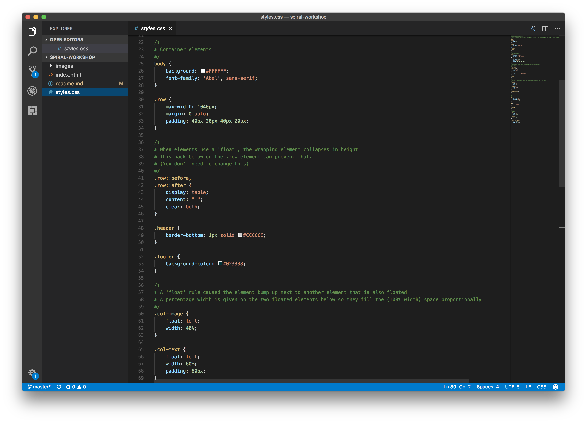
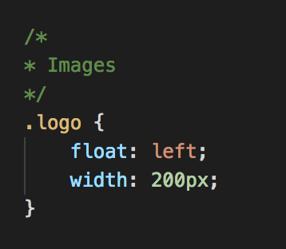

# Template webpage

Code is just text on a page, so you could use a default text editor like 'Notepad' on Windows or 'TextEdit' on a mac, but it's easier to read and notice mistakes with better text editors that colour code the text according to the coding language.

1. Download a text editor if you don't have one. [Visual Studio code](https://code.visualstudio.com/) is a good one for both Windows and Mac.

2. Download the files above by clicking the green button and selecting 'download zip'.

3. There are a few web browsers out there but Google Chrome is an easy one to work with and has built in developer tools. You can download it [here](https://www.google.co.uk/chrome/) if you don't already have it.

4. Open the `index.html` file in your web browser to see the webpage template you will be editing.

5. In Google Chrome you can use the developer tools to inspect the webpage.

Right click on the page and click `inspect`.

You can now see and explore the HTML and CSS of the page (or any webpage).

4. Open the `index.html` and `style.css` files in a text editor as you will be working on them.

5. **Remember!** Any time you make a change to either file, you will need to save it (file save in Visual Studio Code) and then refresh the screen in the browser to see it take effect.

## The HTML

The `index.html` is the content of your webpage.

Light background reading:

[Basic HTML structure explained](https://www.w3schools.com/html/html_basic.asp)

[HTML elements explained](https://www.w3schools.com/html/html_elements.asp)

[HTML attributes explained](https://www.w3schools.com/html/html_attributes.asp)

HTML elements are represented by tags in the HTML for example a body tag will wrap the entire page and starts like this `<body>` and ends with this `</body>`.

Attributes are additional information given to a HTML element and they start with the attribute name eg `src` (source of the image) and an equals sign `=` and `""` which contains the path to where the image is located.

The HTML elements we are using in this template are:

* `<body>`...`</body>` - A body tag wraps the page content (only ever one on a page) 
* `
`...`
` - div tags are used all the time to wrap anything
* `<h2>`...`</h2>` - h2 (heading 2) tag is for a heading
* `
`...`
` - p (paragraph) tag is for general text
* `<a href="/path/to/link">`...`</a>` - an 'a' (link) tag can wrap text or an image and the location of the link should be set in the `href` attribute.
* `` - img (image) tags are self closing and the location of the image needs to be set in the `src` attribute.

## The CSS

The `styles.css` file contains the styling for your webpage.

Each set of style rules corresponds to a HTML element, which can either be targetted by the tagname eg `
` would be `p`.

Or to be more specific, you can add a class attribute to the HTML element `
` and in the styles you would use a dot to signify it is a class `.copyright`.

## The Tasks

### Add your own logo

* Put your cut out logo in the images folder.

The image files will need to be `.png` or `.jpg`.

* In the HTML file, find where the current logo is `` and replace the file name `logo.jpg` with your own, and also the `alt` attribute text with the name and slogan (this will be hidden but is needed for accessibility and SEO etc).

* In the CSS file, find where it says `.logo` - these are the style rules that define what the logo looks like on the page. You can change the width here to suit your logo.

### Add your own app image

* Same steps as above for the app image. Can you work it out?

### Add your own text content

* Find the text in the HTML which will be wrapped in `
` and `<h2>` tags, and replace with your own content. So this should be the heading, text and copyright text.
* You should also change the title of the page (which appears on the tab of the browser window). This is wrapped in a `<title>` tag near the top of the index.html.

### Add your own font

* Find a font you like from [Google web fonts](https://fonts.google.com/)
* Once you click on the red plus icon, the font will appear in a black box at the bottom. Click the box to view the font you have selected (making sure it is just one font).
* It gives code snippets for both the HTML and the CSS. Find the similar code snippets in this template and replace with your own.

### Have a play with styling of the page...

[Lists of style rules](https://www.w3schools.com/css/default.asp) - links on the left

The main styles we will be changing are:

* `color` : #000000; (applies to text)
* `background-color` : #FFFFFF; (applies to the background colour)
* `font-size` : 14px;
* `width` : 100px; (can be px or %)
* `height` : 200px; (if the width is set, the height doesn't usually need to be)
* `border-bottom` : 1px dotted #CCCCCC (3 values should be given - thickness, type of border, colour)

### Extra task - add fake links for the Apple Store and Google Play buttons

These links are created by and image wrapped by a link tag `<a>` and the link needs to be set in the `href` attribute on the links.

* Can you add links to these in the HTML and see them working?

### Further learning

[A list of learning resources](https://github.com/Nezteb/Teaching_WebDev)